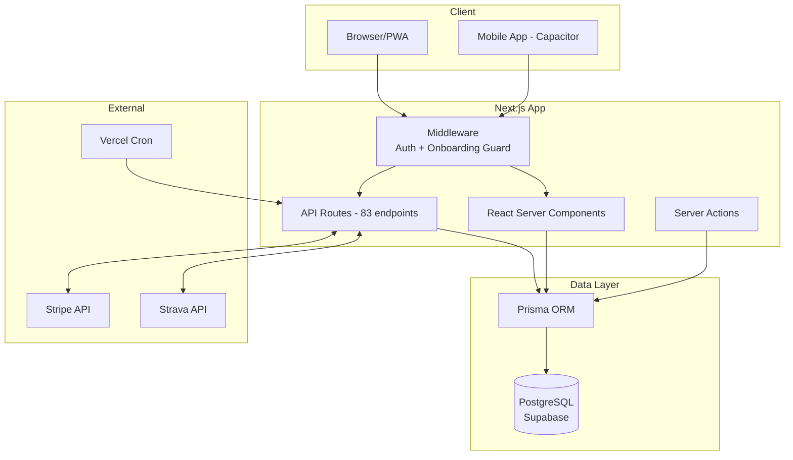
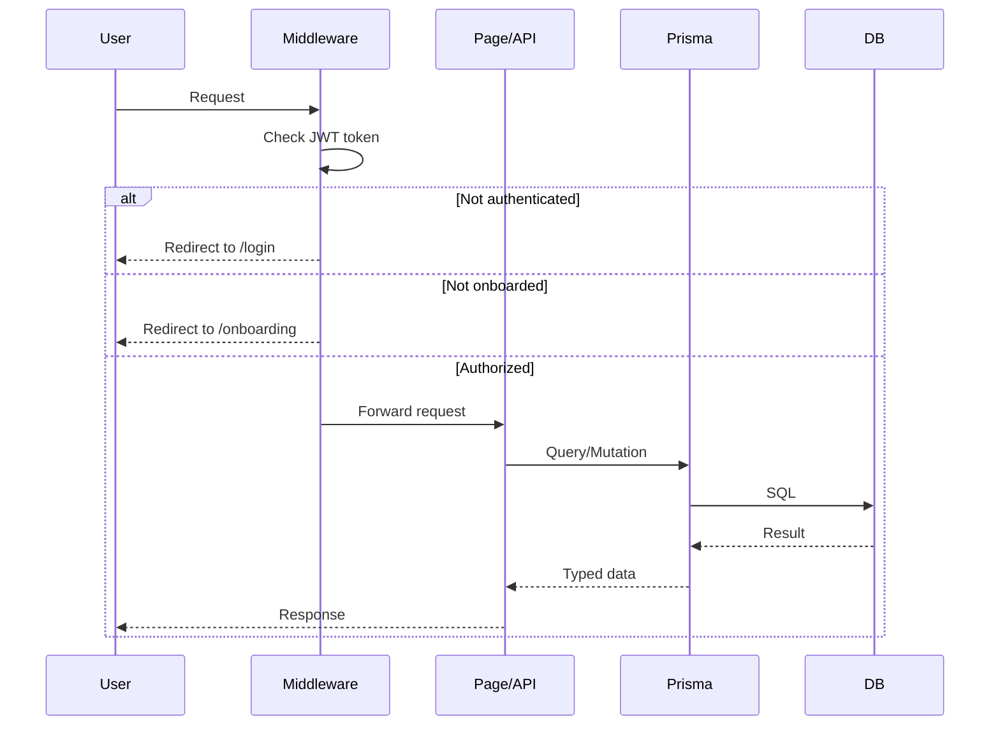
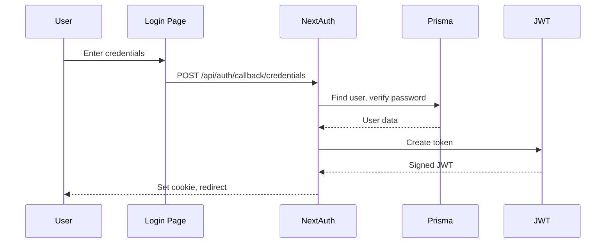
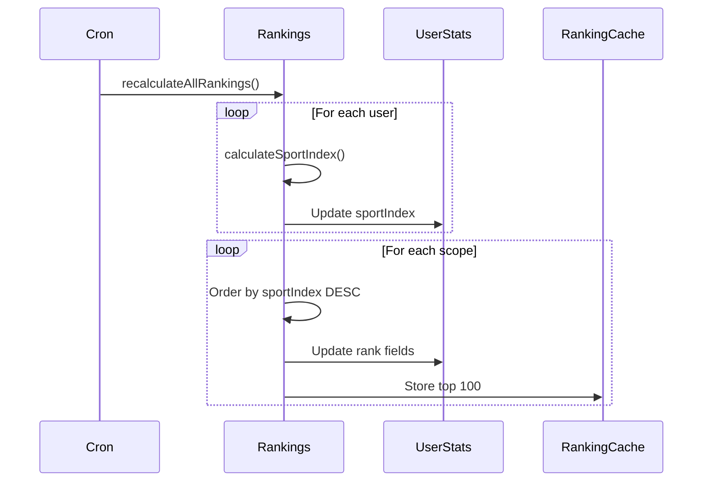
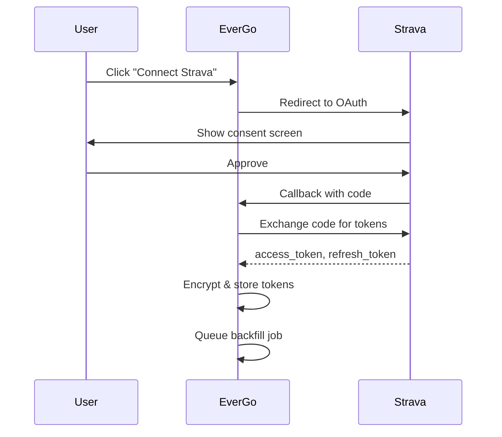

# EverGo - Comprehensive Technical Documentation v7.1

> **The Global Network for Sports** - Track, Compete, Connect

**Version:** 7.1
**Last Updated:** January 7, 2026
**Audit Status:** Verified against codebase

---

## Table of Contents

1. [What's Live Today](#1-whats-live-today)
2. [Technology Stack](#2-technology-stack)
3. [Glossary](#3-glossary)
4. [Architecture Overview](#4-architecture-overview)
5. [Project Structure](#5-project-structure)
6. [Database Schema](#6-database-schema)
7. [API Reference](#7-api-reference)
8. [Authentication & Security](#8-authentication--security)
9. [Sport Index Algorithm](#9-sport-index-algorithm)
10. [Rankings & Leaderboards](#10-rankings--leaderboards)
11. [Background Jobs & Cron](#11-background-jobs--cron)
12. [Observability](#12-observability)
13. [Integrations](#13-integrations)
14. [Testing](#14-testing)
15. [Local Development](#15-local-development)
16. [Deployment](#16-deployment)
17. [Security & Privacy](#17-security--privacy)

---

## 1. What's Live Today

**Feature Status as of January 2026:**

| Feature | Status | Location | Notes |
|---------|--------|----------|-------|
| User Registration & Auth | LIVE | `/app/login`, `/app/register` | NextAuth with credentials |
| Onboarding Wizard | LIVE | `/app/(onboarding)/onboarding` | 4-step: Profile, Sports, Benchmark, Connect |
| Activity Tracking (Manual) | LIVE | `/app/activity/create` | Full CRUD |
| Strava Integration | LIVE | `/lib/integrations/strava` | OAuth + sync + webhook |
| Sport Index | LIVE | `/lib/rankings.ts`, `/lib/scoring/fitness-score.ts` | 0-1000 score |
| Rankings (Global/Country/City) | LIVE | `/app/rankings` | Percentile-first display |
| Leaderboards | LIVE | `/app/leaderboard` | Cached top 100 |
| Challenges | LIVE | `/app/challenges` | Create/join/track |
| Teams | LIVE | `/app/teams` | Create/join with roles |
| Rivalries | LIVE | `/app/rivalries` | 1v1 competitions |
| Social Feed | LIVE | `/app/feed` | Following + Highlights |
| Notifications | LIVE | `/app/notifications` | In-app + push |
| Training Plans | LIVE | `/app/training-plans` | Follow/track workouts |
| Gear Tracking | LIVE | `/api/gear` | Equipment lifecycle |
| Badges & Gamification | LIVE | `/components/gamification` | Achievement system |
| Subscription/Payments | BETA | `/api/subscription` | Stripe integration |
| Communities | BETA | `/app/communities` | Topic-based groups |
| Partner Finder | BETA | `/api/partner-requests` | Workout matching |
| Garmin Integration | ROADMAP | Schema ready | Not implemented |
| Apple Health Sync | ROADMAP | Schema ready | Not implemented |
| Data Export | ROADMAP | - | Not implemented |
| League System | ROADMAP | Schema + partial lib | Incomplete |

---

## 2. Technology Stack

<!-- AUTO:VERSIONS_START -->

| Package | Version |
|---------|---------|
| next | ^16.0.7 |
| react | 19.2.0 |
| react-dom | 19.2.0 |
| typescript | ^5 |
| prisma | ^6.0.0 |
| @prisma/client | ^6.0.0 |
| next-auth | ^4.24.13 |
| tailwindcss | ^4 |
| framer-motion | ^11.18.2 |
| lucide-react | ^0.555.0 |
| zod | ^4.1.13 |
| zustand | ^5.0.9 |
| @playwright/test | ^1.57.0 |
| @supabase/supabase-js | ^2.86.2 |

<!-- AUTO:VERSIONS_END -->

### Infrastructure

| Service | Purpose | Status |
|---------|---------|--------|
| Vercel | Hosting, Edge, Cron | LIVE |
| Supabase | PostgreSQL, Storage | LIVE |
| Stripe | Payments | BETA |
| Strava API | Activity sync | LIVE |

### Package Manager

- **npm** (no lockfile present - reproducibility concern)
- Node.js version: Not specified (recommend adding `.nvmrc`)

---

## 3. Glossary

| Term | Definition |
|------|------------|
| **Sport** | Top-level athletic category (Running, Cycling, Swimming, etc.) |
| **Discipline** | Specific event within a sport (5K, Marathon, FTP Test) |
| **Benchmark** | A specific measurable achievement (5K time, Bench 1RM, VO2max) |
| **Personal Best (PB)** | User's best recorded value for a benchmark |
| **Sport Index** | Composite 0-1000 score calculated from activity volume, benchmarks, and engagement |
| **Ranking** | User's position in a leaderboard for a specific scope |
| **Leaderboard** | Ordered list of users by Sport Index or benchmark |
| **VERIFIED Mode** | Leaderboard showing only device-verified data (Strava, sensors) |
| **COMMUNITY Mode** | Leaderboard including manual entries |
| **Eligibility** | Whether a PB qualifies for a specific scope's ranking |
| **Verification Tier** | BRONZE (manual), SILVER (proof/device), GOLD (GPS-verified device) |

### Eligibility Rules

```
Global Ranking: Requires NON_MANUAL source (device-verified)
Country Ranking: Requires NON_MANUAL source
City Ranking: Allows MANUAL entries (community-focused)
Team Ranking: Allows MANUAL entries
```

---

## 4. Architecture Overview



### Request Flow



---

## 5. Project Structure

```
/Users/michal/Evergo/
├── app/                              # Next.js App Router (42 pages)
│   ├── (onboarding)/onboarding/      # Onboarding wizard
│   ├── api/                          # API Routes (83 files)
│   │   ├── auth/                     # NextAuth
│   │   ├── cron/                     # Scheduled jobs (4)
│   │   ├── strava/                   # Strava integration
│   │   └── ...
│   ├── home/                         # Main dashboard
│   ├── feed/                         # Social feed
│   ├── rankings/                     # Rankings pages
│   └── ...
├── components/                       # React Components (41 categories)
├── lib/                              # Business Logic
│   ├── auth.ts                       # NextAuth config
│   ├── db.ts                         # Prisma client
│   ├── env.ts                        # Environment helpers
│   ├── env.validated.ts              # Zod-validated env (NEW)
│   ├── cron/                         # Cron utilities (NEW)
│   ├── observability.ts              # Logging/tracing (NEW)
│   ├── rankings.ts                   # Sport Index calculation
│   ├── rankings/                     # Rankings module
│   ├── scoring/                      # Fitness score calculation
│   └── integrations/strava/          # Strava client
├── prisma/
│   └── schema.prisma                 # 80 models, 48 enums
├── scripts/
│   └── docs/                         # Doc generation scripts (NEW)
├── tests/                            # Unit tests (NEW)
├── e2e/                              # Playwright E2E tests
├── docs/generated/                   # Auto-generated docs (NEW)
└── package.json
```

---

## 6. Database Schema

<!-- AUTO:SCHEMA_STATS_START -->

### Database Schema Statistics

| Metric | Count |
|--------|-------|
| Models | 80 |
| Enums | 48 |
| Total Fields | ~1200 |

### Models by Domain

| Category | Models | Count |
|----------|--------|-------|
| User & Auth | User, UserStats, UserStreak, UserBadge, Subscription, ... | 12 |
| Sports & Activities | Activity, Sport, Discipline, ActivityGear, PersonalRecord, ... | 11 |
| Rankings & Leaderboards | Ranking, RankingCache, DisciplineLeaderboardCache, SportIndexEvent, ... | 7 |
| Gamification | Badge, Challenge, ChallengeParticipant, Rivalry, Target, ... | 12 |
| Social | Post, Comment, Like, FeedItem, Follow, ... | 8 |
| Teams & Communities | Team, TeamMember, Community, CommunityMember, League, ... | 10 |
| Integrations | StravaConnection, IntegrationJob, ActivityImport, ... | 8 |
| Training | TrainingPlan, TrainingPlanWeek, TrainingPlanWorkout, UserTrainingPlan | 4 |
| Other | City, InviteCode, AnalyticsEvent, CronJobRun, ... | 8 |

### Key Enums

| Enum | Values |
|------|--------|
| SportCategory | ENDURANCE, CYCLING, SWIMMING, STRENGTH, TEAM, ... |
| VerificationTier | BRONZE, SILVER, GOLD |
| VerificationSource | MANUAL, STRAVA, GARMIN, APPLE_HEALTH, ... |
| DisciplineKind | FITNESS_SCORE, SPORT_INDEX, BENCHMARK, ELO_RATING |
| MinVerificationTier | ANY, NON_MANUAL, VERIFIED_ONLY |

<!-- AUTO:SCHEMA_STATS_END -->

### Key Models

```prisma
model User {
  id                    String    @id @default(cuid())
  email                 String    @unique
  username              String    @unique
  onboardingCompleted   Boolean   @default(false)
  primarySportId        String?
  countryCode           String?   // ISO 3166-1 alpha-2
  cityName              String?
  // ... 30+ relations
}

model Activity {
  id              String    @id @default(cuid())
  userId          String
  disciplineId    String
  durationSeconds Int?
  distanceMeters  Float?
  source          String    @default("MANUAL")
  verificationTier VerificationTier @default(BRONZE)
  effortPoints    Int       @default(0)
  // ...
}

model UserStats {
  userId          String    @unique
  sportIndex      Int       @default(0)    // 0-1000
  globalRank      Int?
  countryRank     Int?
  cityRank        Int?
  isVerifiedAthlete Boolean @default(false)
}

// NEW: Cron job tracking
model CronJobRun {
  id              String    @id @default(cuid())
  jobName         String
  runId           String
  status          String    @default("IN_PROGRESS")
  startedAt       DateTime  @default(now())
  finishedAt      DateTime?
  durationMs      Int?
  recordsProcessed Int      @default(0)
  recordsUpdated  Int       @default(0)
  errorSummary    String?
  statsJson       String?
  @@unique([jobName, runId])
}
```

---

## 7. API Reference

<!-- AUTO:API_ROUTES_START -->

**Total API Routes: 83**

### Core Endpoints

| Endpoint | Methods | Description |
|----------|---------|-------------|
| `/api/auth/[...nextauth]` | GET, POST | NextAuth handler |
| `/api/auth/register` | POST | User registration |
| `/api/activities` | POST | Create activity |
| `/api/user/profile` | GET, PATCH | User profile |
| `/api/user/sports` | GET, POST | Manage sports |
| `/api/rankings/leaderboard` | GET | Query leaderboard |
| `/api/health` | GET | Health check |

### Cron Endpoints

| Endpoint | Methods | Auth | Schedule |
|----------|---------|------|----------|
| `/api/cron/recalculate-rankings` | GET | NONE* | Manual |
| `/api/cron/activity-score` | POST, GET | CRON_SECRET | Daily |
| `/api/cron/strava-sync` | GET | CRON_SECRET | Daily 6am |
| `/api/cron/teams` | GET | CRON_SECRET | Manual |

*WARNING: `/api/cron/recalculate-rankings` has auth commented out

### Categories

| Category | Count |
|----------|-------|
| auth | 2 |
| user | 6 |
| activities | 1 |
| feed | 3 |
| posts | 4 |
| rankings | 7 |
| challenges | 3 |
| teams | 6 |
| communities | 4 |
| notifications | 4 |
| strava | 5 |
| training-plans | 5 |
| cron | 4 |
| other | 29 |

<!-- AUTO:API_ROUTES_END -->

### Example: Create Activity

**Request:**
```http
POST /api/activities
Authorization: Bearer <session-token>
Content-Type: application/json

{
  "sportId": "clxx...",
  "disciplineId": "clxx...",
  "title": "Morning Run",
  "activityDate": "2026-01-07T08:00:00Z",
  "durationSeconds": 3600,
  "distanceMeters": 10000,
  "rpe": 6
}
```

**Response:**
```json
{
  "id": "clxx...",
  "title": "Morning Run",
  "effortPoints": 980,
  "verificationTier": "BRONZE"
}
```

---

## 8. Authentication & Security

### Auth Flow



### Session Configuration

```typescript
// lib/auth.ts
export const authOptions: NextAuthOptions = {
  providers: [
    CredentialsProvider({
      credentials: {
        email: { type: "email" },
        password: { type: "password" }
      },
      async authorize(credentials) {
        // Validate and return user
      }
    })
  ],
  session: {
    strategy: "jwt",
    maxAge: 30 * 24 * 60 * 60 // 30 days
  },
  callbacks: {
    jwt({ token, user }) {
      if (user) {
        token.id = user.id
        token.onboardingCompleted = user.onboardingCompleted
      }
      return token
    }
  }
}
```

### Middleware Protection

Protected routes redirect unauthenticated users to `/login`.
Non-onboarded users are redirected to `/onboarding`.

```typescript
// middleware.ts
const protectedRoutes = ["/home", "/feed", "/profile", "/settings", ...]
const onboardingRequiredRoutes = ["/home", "/feed", "/profile"]
```

---

## 9. Sport Index Algorithm

### Overview

The Sport Index is a **0-1000 composite score** representing overall athletic performance.

**Location:** `lib/rankings.ts` (main) + `lib/scoring/fitness-score.ts` (MET calculation)

### Formula

```
SportIndex = min(1000, sum of:
  + frequencyScore     (max 200) - Activities per week × 25
  + performanceScore   (max 400) - Weighted percentile across sports
  + streakScore        (max 150) - Current streak × 5
  + varietyScore       (max 100) - Number of sports × 25
  + improvementScore   (max 100) - Month-over-month improvement
  + socialScore        (max  50) - Team memberships × 10
)
```

### Constants

```typescript
// lib/rankings.ts
const WEIGHTS = {
  FREQUENCY_MAX: 200,
  FREQUENCY_PER_ACTIVITY: 25,     // 8+ activities/week = max
  PERFORMANCE_MAX: 400,
  STREAK_MAX: 150,
  STREAK_MULTIPLIER: 5,           // 30+ day streak = max
  VARIETY_MAX: 100,
  VARIETY_PER_SPORT: 25,          // 4+ sports = max
  IMPROVEMENT_MAX: 100,
  SOCIAL_MAX: 50,
  SOCIAL_PER_TEAM: 10,
}
```

### Fitness Score (MET-based)

Individual activities are scored using MET (Metabolic Equivalent of Task):

```typescript
// lib/scoring/fitness-score.ts
export function calculateMETHours(input: FitnessScoreInput): number {
  const durationHours = input.durationSeconds / 3600
  const met = input.sport.metDefault
  const intensityFactor = calculateIntensityFactor(input)
  return met * durationHours * intensityFactor
}

// Intensity factors:
// - Heart rate zones: 0.6 (recovery) to 1.4 (anaerobic)
// - RPE 1-10: maps to 0.69 to 1.50
// - Elevation gain: up to 30% bonus for steep climbs
```

### Default MET Values

| Sport | MET |
|-------|-----|
| Running | 9.8 |
| Cycling | 7.5 |
| Swimming | 8.0 |
| CrossFit | 8.0 |
| Yoga | 2.5 |

### Test Vectors

See `tests/fitness-score.test.ts` for deterministic test cases:

```bash
npm run test:unit
```

---

## 10. Rankings & Leaderboards

### Two-Mode System

| Mode | Data Sources | Use Case |
|------|--------------|----------|
| VERIFIED | Strava, Garmin, sensors | Competitive rankings |
| COMMUNITY | All including manual | Local/team competition |

### Scopes

| Scope | Filter | Eligibility |
|-------|--------|-------------|
| Global | None | NON_MANUAL only |
| Country | `countryCode` | NON_MANUAL only |
| City | `cityId` | ANY (includes manual) |
| Team | `teamId` | ANY |
| Friends | `followingIds` | ANY |

### Percentile Display

Rankings are shown as percentiles first:

```typescript
// lib/rankings/percentile.ts
export function formatPercentile(percentile: number): string {
  if (percentile >= 99) return "Top 1%"
  if (percentile >= 95) return "Top 5%"
  if (percentile >= 90) return "Top 10%"
  // ...
}
```

### Cache Strategy

- `RankingCache`: Top 100 per scope, JSON blob
- `DisciplineLeaderboardCache`: Per-discipline rankings
- Invalidation: On activity create/update, benchmark update, or algorithm version bump
- Version tracking: `algoVersion` field for cache invalidation

### Ranking Update Flow



---

## 11. Background Jobs & Cron

### Scheduler

Jobs are scheduled via **Vercel Cron** (configured in `vercel.json`):

```json
{
  "crons": [
    { "path": "/api/cron/strava-sync", "schedule": "0 6 * * *" },
    { "path": "/api/jobs/run", "schedule": "0 7 * * *" }
  ]
}
```

### Job Inventory

| Job | Path | Schedule | Auth |
|-----|------|----------|------|
| Strava Sync | `/api/cron/strava-sync` | Daily 6am | CRON_SECRET |
| Job Runner | `/api/jobs/run` | Daily 7am | EVERGO_JOB_SECRET |
| Activity Score | `/api/cron/activity-score` | Manual | CRON_SECRET |
| Rankings | `/api/cron/recalculate-rankings` | Manual | **NONE** |
| Teams | `/api/cron/teams` | Manual | CRON_SECRET |

### Auth Mechanism

Jobs verify the `Authorization: Bearer <CRON_SECRET>` header:

```typescript
// lib/cron/index.ts
export function verifyCronRequest(request: NextRequest): NextResponse | null {
  const cronSecret = process.env.CRON_SECRET
  const authHeader = request.headers.get("authorization")

  if (authHeader === `Bearer ${cronSecret}`) {
    return null // Authorized
  }

  return NextResponse.json({ error: "Unauthorized" }, { status: 401 })
}
```

### Locking & Idempotency

Use `runCronJob()` wrapper for locking:

```typescript
import { verifyCronRequest, runCronJob } from "@/lib/cron"

export async function GET(request: NextRequest) {
  const authError = verifyCronRequest(request)
  if (authError) return authError

  return runCronJob(
    { jobName: "recalculate-rankings" },
    async (ctx) => {
      const count = await recalculateAllRankings()
      return { recordsUpdated: count }
    }
  )
}
```

### Monitoring

Job runs are tracked in `CronJobRun` table:
- View history: `SELECT * FROM "CronJobRun" ORDER BY startedAt DESC`
- Last successful run shown in `/api/health` response

### Common Failures

| Issue | Remediation |
|-------|-------------|
| Timeout (>30s) | Reduce batch size, add pagination |
| Concurrent runs | Lock already acquired - wait or clear stale locks |
| DB connection | Check DATABASE_URL, Supabase status |

---

## 12. Observability

### Logging

Structured logging via `lib/observability.ts`:

```typescript
import { log, getRequestId } from "@/lib/observability"

log.info("Activity created", {
  requestId: getRequestId(),
  userId: session.user.id,
  action: "createActivity",
  activityId: activity.id,
})
```

Output format:
```
[2026-01-07T12:00:00Z] [INFO] [req:a1b2c3] [user:clxx1234] [createActivity] Activity created
```

### Error Reporting

Errors are captured via `captureException()`:

```typescript
import { captureException } from "@/lib/observability"

try {
  await riskyOperation()
} catch (error) {
  captureException(error, {
    userId: session.user.id,
    extra: { context: "..." },
  })
}
```

**Note:** Sentry integration is stubbed. To enable:
1. `npm install @sentry/nextjs`
2. Run `npx @sentry/wizard@latest -i nextjs`
3. Update `lib/observability.ts`

### Health Endpoint

```http
GET /api/health
```

Response:
```json
{
  "status": "ok",
  "version": "0.1.0",
  "commit": "abc1234",
  "timestamp": "2026-01-07T12:00:00Z",
  "checks": {
    "database": {
      "status": "connected",
      "responseMs": 15,
      "userCount": 1234
    },
    "cron": {
      "lastRun": "strava-sync @ 2026-01-07T06:00:00Z"
    }
  },
  "config": {
    "hasDbUrl": true,
    "hasNextAuthSecret": true,
    "hasCronSecret": true
  }
}
```

### Secret Redaction

Secrets are automatically redacted from logs:

```typescript
import { redactSecrets } from "@/lib/observability"

log.info(redactSecrets(debugData))
// Bearer tokens, passwords, API keys -> "[REDACTED]"
```

---

## 13. Integrations

### Strava

**Location:** `lib/integrations/strava/`

#### OAuth Flow



#### Sync Mechanism

| Method | Trigger | Description |
|--------|---------|-------------|
| Backfill | Initial connect | Import last 30 days |
| Webhook | Real-time | Strava pushes new activities |
| Cron | Daily 6am | Catch missed webhooks |
| Manual | User action | Force sync button |

#### Token Storage

Refresh tokens are encrypted before storage:

```typescript
// lib/integrations/strava/crypto.ts
export function encryptToken(token: string): string
export function decryptToken(encrypted: string): string
```

**Security note:** Encryption key stored in `STRAVA_SYNC_SIGNING_SECRET`.

### File Import (FIT/GPX/TCX)

**Location:** `lib/import/parsers/`

Supported formats:
- FIT (Garmin, Wahoo)
- GPX (universal GPS)
- TCX (Garmin legacy)

---

## 14. Testing

### E2E Tests (Playwright)

```bash
# Run all tests
npm test

# Specific browser
npm run test:chromium
npm run test:firefox

# Mobile viewports
npm run test:mobile

# Accessibility
npm run test:a11y
```

### Unit Tests

```bash
# Run fitness score tests
npm run test:unit
```

Test file: `tests/fitness-score.test.ts`

### Mike AI Framework

Custom scenario-based testing:

```bash
npm run mike:smoke    # Quick tests
npm run mike:full     # Comprehensive
npm run mike:discover # Auto-discover pages
```

---

## 15. Local Development

### Prerequisites

- Node.js 20+
- PostgreSQL (or Supabase)

### Setup

```bash
# Clone repository
git clone <repo-url>
cd Evergo

# Install dependencies
npm install

# Create .env file
cp .env.example .env
# Edit .env with your credentials

# Push schema to database
npm run db:push

# Seed data
npm run db:seed

# Start development server
npm run dev
```

### Required Environment Variables

```env
# Database (required)
DATABASE_URL="postgresql://..."
DIRECT_URL="postgresql://..."

# Auth (required)
NEXTAUTH_SECRET="your-secret-here"
NEXTAUTH_URL="http://localhost:3000"

# Strava (optional)
STRAVA_CLIENT_ID="..."
STRAVA_CLIENT_SECRET="..."

# Cron (required for prod)
CRON_SECRET="..."
```

### Common Commands

```bash
npm run dev           # Start dev server
npm run build         # Production build
npm run typecheck     # Type checking
npm run lint          # ESLint
npm run db:studio     # Prisma Studio
npm run docs:generate # Regenerate doc sections
npm run test:unit     # Run unit tests
npm test              # Run E2E tests
```

---

## 16. Deployment

### Environments

| Environment | URL | Database |
|-------------|-----|----------|
| Production | https://evergo-pi.vercel.app | Supabase prod |
| Preview | https://evergo-{branch}.vercel.app | Supabase dev |
| Local | http://localhost:3000 | Local/Supabase |

### Vercel Configuration

```json
// vercel.json
{
  "buildCommand": "npm run vercel-build",
  "crons": [
    { "path": "/api/cron/strava-sync", "schedule": "0 6 * * *" },
    { "path": "/api/jobs/run", "schedule": "0 7 * * *" }
  ]
}
```

### Deploy Checklist

1. Ensure all env vars are set in Vercel
2. Run `npm run typecheck` locally
3. Push to main branch
4. Monitor deployment in Vercel dashboard
5. Check `/api/health` after deploy

---

## 17. Security & Privacy

### Data Classification

| Category | Examples | Handling |
|----------|----------|----------|
| PII | Email, name, location | Encrypted at rest (Supabase) |
| Auth tokens | Password hashes, JWT | bcrypt, signed JWT |
| Integration tokens | Strava refresh token | Encrypted before storage |
| Activity data | Routes, times | User-owned, deletable |

### User Deletion

**Path:** `DELETE /api/user/delete`

Current behavior:
1. Cascade delete via Prisma relations
2. Remove user stats, activities, posts
3. Disconnect integrations

**TODO:** Verify storage asset cleanup (Supabase files)

### Data Export

**Status:** ROADMAP - Not implemented

### Token Encryption

```typescript
// Strava tokens encrypted in:
// - StravaConnection.refreshTokenEnc (encrypted string)
// - Key: process.env.STRAVA_SYNC_SIGNING_SECRET
```

### Rate Limiting

```typescript
// lib/rate-limit.ts
export const rateLimits = {
  api: { requests: 100, window: 60_000 },      // 100/min
  auth: { requests: 10, window: 900_000 },     // 10/15min
  search: { requests: 30, window: 60_000 },    // 30/min
  upload: { requests: 20, window: 3600_000 },  // 20/hour
}
```

---

## Appendix: File Inventory

### New Files (This Update)

| File | Purpose |
|------|---------|
| `lib/env.validated.ts` | Zod-validated environment config |
| `lib/cron/index.ts` | Cron auth, locking, execution wrapper |
| `lib/observability.ts` | Logging, error capture, secret redaction |
| `scripts/docs/generate-versions.ts` | Auto-generate versions table |
| `scripts/docs/generate-api-reference.ts` | Auto-generate API list |
| `scripts/docs/generate-schema-reference.ts` | Auto-generate schema stats |
| `tests/fitness-score.test.ts` | Sport Index unit tests |
| `docs/generated/baseline-audit.json` | Phase 0 audit results |
| `prisma/schema.prisma` | Added CronJobRun model |

### Updated Files

| File | Changes |
|------|---------|
| `app/api/health/route.ts` | Enhanced with version, cron status |
| `package.json` | Added docs:* and test:unit scripts |
| `EVERGO7.md` | Complete rewrite to match reality |

---

*Document Version: 7.1*
*Last Updated: January 7, 2026*
*Verified against codebase commit: (see /api/health)*
